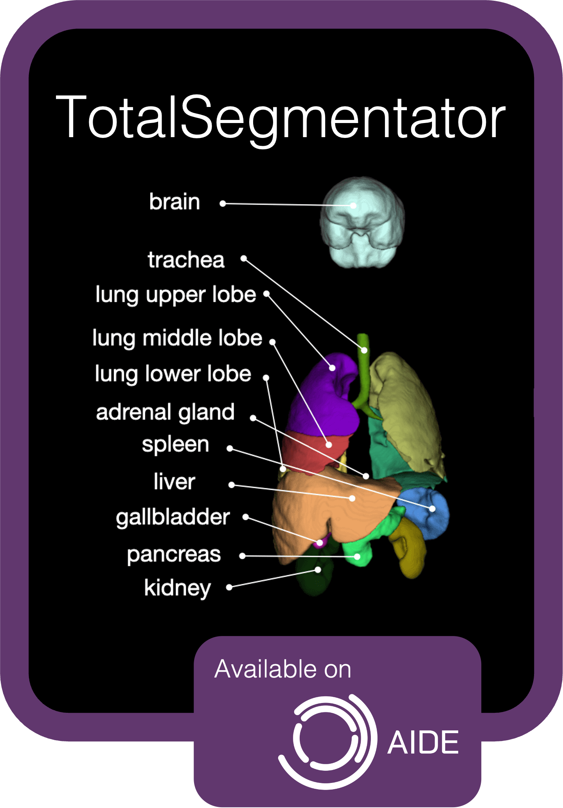
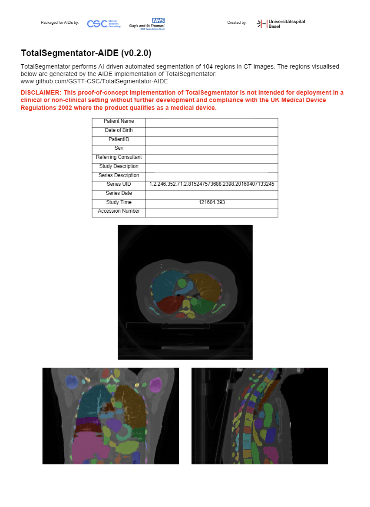

<!-- PROJECT HEADING -->
<br />
<p align="center">
<a href="https://github.com/GSTT-CSC/TotalSegmentator-AIDE">
  
</a>
<h1 align="center">TotalSegmentator-AIDE</h1>
<p align="center">
  <a href="https://github.com/wasserth/TotalSegmentator">TotalSegmentator</a> packaged as an AIDE Application, based on 
  the open-source <a href="https://github.com/Project-MONAI/monai-deploy/blob/main/guidelines/monai-application-package.md">
  MONAI Application Package (MAP)</a> standard.
  <br />
  <br />
  <a href="https://github.com/GSTT-CSC/TotalSegmentator-AIDE">View repo</a>
  ·
  <a href="https://github.com/GSTT-CSC/TotalSegmentator-AIDE/issues">Report Bug</a>
  ·
  <a href="https://github.com/GSTT-CSC/TotalSegmentator-AIDE/issues">Request Feature</a>
  <br />
</p>

## TotalSegmentator MAP workflow

The input to the TotalSegmentator MAP is a folder containing CT DICOM `.dcm` files. The output is an RT Struct DICOM `.dcm` 
file containing the contours of all the segmented regions.

The TotalSegmentator MAP consists of three operators:
1. `dcm2nii_operator.py` – converts the input CT DICOM files to NIfTI format required by TotalSegmentator, using 
[dcm2niix](https://github.com/rordenlab/dcm2niix)
2. `totalsegmentator_operator.py` – runs TotalSegmentator
3. `rtstructwriter_operator.py` – converts the output segmentations from NIfTI to DICOM RT Struct format, using 
[rt-utils](https://github.com/qurit/rt-utils/tree/main/rt_utils)
4. `clinrev_pdf_operator.py` – creates a DICOM encapsulated PDF showing three views of the input CT dataset overlaid 
with the segmentations generated by TotalSegmentator

## Developer Guidelines

### Prerequisites
- GPU-enabled machine
- Docker
  - Required for running the MAP. Not required for running source code
- dcm2niix ([see build instructions](#dcm2niix-install))

## Setup

1. Download
```shell
git clone https://github.com/GSTT-CSC/TotalSegmentator-AIDE.git
```

2. Setup virtual env
```shell
cd TotalSegmentator-AIDE

python -m venv venv
source venv/bin/activate

pip install --upgrade pip setuptools wheel
pip install -r requirements.txt
```

3. Create `input` and `output` directories
```shell
mkdir input output
```

## Run source code with MONAI Deploy

1. Ensure Python venv running
2. Copy DICOM `.dcm` files to `input/` directory


```shell
monai-deploy exec app -i input/ -o -output/

# alternatively:
python app -i input/ -o output/
```

## Build and run as MONAI Application Package (MAP)

1. Ensure Python venv running
2. Ensure Docker running
3. Copy DICOM `.dcm` files to `input/` directory

_Important:_ we create an initial MAP `map-init` upon which we build any 3rd-party non-Python software (e.g. dcm2niix). 
The final MAP is called `map`

```shell
# Initial packaging of MAP
monai-deploy package app --tag ghcr.io/gstt-csc/totalsegmentator-aide/map-init:0.2.0 -l DEBUG

# Build 3rd-party software on top of MAP
docker build -t ghcr.io/gstt-csc/totalsegmentator-aide/map:0.2.0 app/

# Test MAP with MONAI Deploy
monai-deploy run ghcr.io/gstt-csc/totalsegmentator-aide/map:0.2.0 input/ output/

# Push initial MAP and final MAP to GHCR
docker push ghcr.io/gstt-csc/totalsegmentator-aide/map-init:0.2.0
docker push ghcr.io/gstt-csc/totalsegmentator-aide/map:0.2.0
```

### Optional 

Enter Docker container for testing

```shell
docker run --gpus all -it --rm -v /TotalSegmentator-AIDE/input:/var/monai/input/ --entrypoint /bin/bash ghcr.io/gstt-csc/totalsegmentator-aide/map:0.2.0
```

Run on specified GPU if machine has >1 available

```shell
CUDA_VISIBLE_DEVICES=2 monai-deploy run ghcr.io/gstt-csc/totalsegmentator-aide/map:0.2.0 input/ output/
```

Reminder: if GHCR requires Personal Access Token
```shell
echo $CR_PAT | docker login ghcr.io -u <github-username> --password-stdin
docker push ghcr.io/gstt-csc/totalsegmentator-aide/map-init:0.2.0
```

## dcm2niix install

This MAP requires [dcm2niix](https://github.com/rordenlab/dcm2niix). For best performance, we build from source 
following the [guidelines here](https://github.com/rordenlab/dcm2niix#build-from-source).

Instructions in short (assuming Ubuntu):
```shell
# install dcm2niix dependencies
sudo apt-get install cmake pkg-config

# build and install dcm2niix
git clone https://github.com/rordenlab/dcm2niix.git
cd dcm2niix
mkdir build && cd build
cmake -DZLIB_IMPLEMENTATION=Cloudflare -DUSE_JPEGLS=ON -DUSE_OPENJPEG=ON ..
sudo make install # creates dcm2niix inside /usr/local/bin

# test install
dcm2niix -h
```

## GitHub Packages

Note: two containers are present under GitHub Packages:
- [`totalsegmentator-aide/map`](https://github.com/orgs/GSTT-CSC/packages/container/package/totalsegmentator-aide%2Fmap)
- [`totalsegmentator-aide/map-init`](https://github.com/orgs/GSTT-CSC/packages/container/package/totalsegmentator-aide%2Fmap-init)

The `map` version is for general usage and deployment. The `map-init` version is for developers who wish to build the 
MAP from scratch as part of the two-step build process described above.

## DICOM Encapsulated PDF
AIDE Clinical Review is a user interface within AIDE for assessing the quality of AI results. It can display DICOM 
Encapsulated PDFs. The screenshot below is an example PDF generated by `clinrev_pdf_operator.py`:

<p align="center">
  
</p>

## Running on AIDE
To run TotalSegmentator on AIDE, two files from the `app/workflows` directory are required, namely:
- `totalsegmentator.json` – AIDE Clinical Workflow file.
  - Effectively a sequence of tasks run on AIDE
- `totalsegmentator-argo-template.yaml` – Argo Workflow Template file.
  - Called by the AIDE Clinical Workflow file. Executes the Totalsegmentator-AIDE MAP using Argo. This is the central 
  task within the AIDE Clinical Workflow file.

The `app/workflows` directory also contains four illustrative Argo Workflow Templates depending on system performance. 
`low`, `medium`, `high` and `dgx` examples are provided with different CPU and RAM settings.
